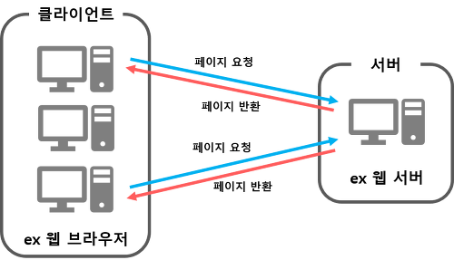
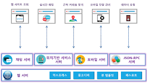

# 2024모각소 0110

## 전체 목표

1. Node.js의 개념을 정확히 이해하기
2. Node.js를 통해 외부 API 연동해 나만의 웹 서버 하나 만들어보기

## 0110 목표
### 1. 서버란 무엇인가?
  
>**클라이언트**- 다른 곳에 있는 단말에 데이터를 달라고 요청하는 프로그램   
>**서버**- 다른 곳에서 요청받은 명령을 처리해주는 프로그램   
**프로토콜**- 데이터를 서로 어떤 형태로 주고받을 것인지를 정한것으로 데이터의 형태   
>**HTTP 프로토콜**- 인터넷상에서 데이터를 어떻게 주고받으면 되는지를 정의한 것

#### 웹서버의 큰 틀

> 웹 브라우저가 **HTTP 프로토콜** 로부터 데이터를 전달받으면 웹 브라우저  >화면에 웹 문서를 띄우고 이 웹 문서가 클라이언트 프로그램 역할. 웹 문서는  >필요할때마다 웹서버로 필요한 웹 문서를 요청해 받아옴

> 모바일 단말에서는 웹 문서를 웹서버가 아닌 단말내부에 저장했다 화면에 띄운후 웹서버로 필요한 데이터만 요청 -> **에이잭스(AJAX) 방식**    
> AJAX 방식 이용하면 필요한 데이터만 가져와 갱신해 **화면 처리 속도가 빠름**
>  

### 2. 서버의 동작

 > 프레임워크인 `익스프레스(Express)`로 기본구조 만들고 데이터베이스 `몽고디비(MongoDB)`를 통해 데이터 저장 및 조회   
  `뷰 템플릿(View Template)`은 클라이언트에 응답을 보낼 때 사요앟려고 미리 **문서의 원형(Template)** 을 만들어 놓은 것이며 `패스포트(Passport)`는 사용자 로그인이나 회원가입을 위해 사용함 
> **localhost** -> PC 자신을 나타내는 인터넷 주소

      

### 3. 서버의 종류
      

#### 3-1. 채팅서버
> **채팅서버**는 실시간 채팅기능을 `클라이언트` 에서 사용하고 싶을때 사용   
채팅서버는 웹 서버에 기능을 추가한 형태

#### 3-2. JSON-RPC 서버
> **JSON-RPC 서버** 는 서버 쪽에 함수를 만들어 두고 클라이언트에 함수를 호출하듯 데이터를 요청하면 응답하는 서버    
웹문서가 아닌 `데이터만을 주고받을 때` 사용   
`JSON`-> 표준데이터 포멧   
`RPC(Remote Procedure Call)` -> 데이터 주고받는 방식 RPC란 서 쪽에 함수를 만들어 두고 클라이언트에서 함수를 호출 하듯 데이터를 요청할 수 있도록 만들어 주는 표준    
`JSON 과 RPC 표준` 을 함께 사용하면 서버 쪽에 구축해야하는 기능을 **함수별로 명확하게 구분하여 만들 수 있음**

#### 3-3. 위치 기반 서비스 서버
> **위치 기반 서비스 서버** 는 위치 정보를 저장하고 조회할 때 사용   
위치 정보 `경도와 위도 좌표` 두가지 숫자 값을 데이터베이스에서 그대로 저장시 데이터 양이 늘어나게 됨   
 두 개의 값을 한꺼번에 비교하여 조회시 검색 속도 현저히 떨어짐 -> `효율적으로 저장하고 조회하는 별도의 방법` 필요 ( `위치 기반 서비스 서버`)
 위치 정보 - **공간 데이터(Spatial Data)**       
 검색 속도가 떨어지지 않도록 **공간 인덱싱(Spatial Indexing)** 사용(B-Tree 인덱싱) 

 #### 3-4. 모바일 서버

> 웹 서버의 기능만으로 앱에서 서버에 데이터를 보내 저장하거나 서버의 데이터를 조회하는 기능 이용 가능   
그러나 어떤 모바일 단말을 사용하는지 혹은 모바일 단말로 푸시 메시지를 보내고 싶은 경우 -> `모바일 전용 기능을 사용할 수 있도록` **모바일 서버** 이용 