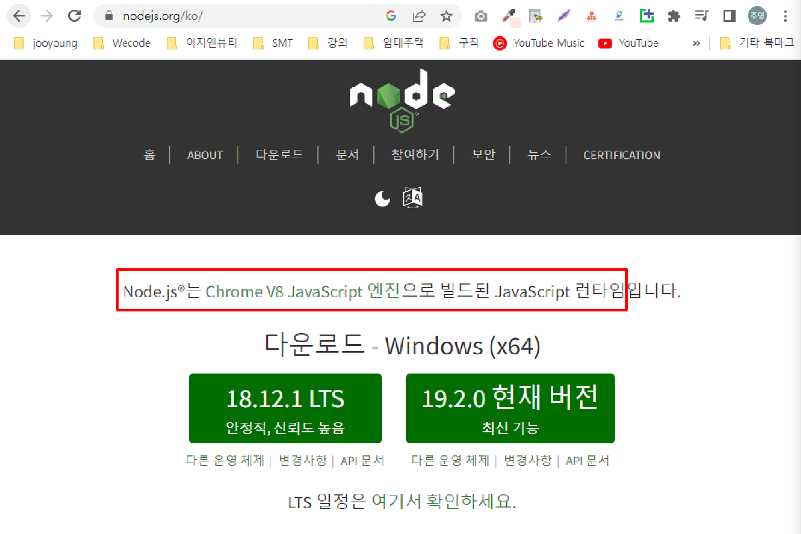
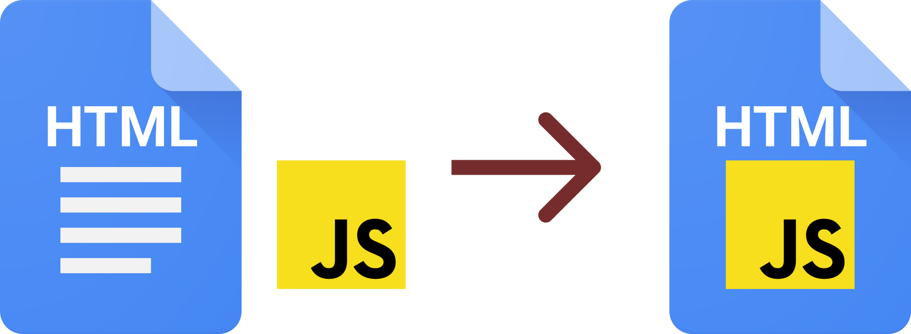
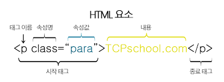

# 2024모각소 0117

## 전체 목표

1. Node.js의 개념을 정확히 이해하기
2. Node.js를 통해 외부 API 연동해 나만의 웹 서버 하나 만들어보기

## 0117 목표

### Node.js 알기

#### Node.js 란?

* **Node.js**는 Chrome V8 JavaScript 엔진으로 빌드된 `JavaScript` 런타임

* 언어가 아닌 JavaScript라는 언어로 `서버를 개발할 수 있도록 도와주는 도구`
* 백엔드 개발에서 자바스크립트를 사용할수 있게 환경을 만들어줌
      


#### JavaScript란?
* **JavaScript**는 `HTML`에 종속되어있는 언어
* HTML 조작과 변경을 위해 사용
      

#### HTML이란?
* **HTML** 은 `Hyper Text Markup Language` 약어로 HyperText(웹 페이지에서 다른 페이지로 이동할 수 있도록 하는 것) 기능을 가진 문서를 만드는 언어
    * 엘리먼트(element) - 요소    
        콘텐츠(요소포함)를 감싸는 태그(tag)
            
    * open tag - 여는 태그
    * close tag - 닫는 태그  (요소 혹은 콘텐츠를 감싸기 위해)
    * 닫는 태그(close tag)가 없는 HTML 요소 -  콘텐츠(contents)를 감싸지 않아 비어있다는 의미          
     ``` html 
      <meta charset="utf-8">  
    ```
    * 애트리뷰트(attribute) - 속성
    * 벨류(value) - 값

          

#### Express란?
* 서버를 만들 때마다 `반복되는 패턴과 복잡한 기능을 처리해 주는 함수` 제공
* 빠르게 서버 만들고 기능 추가 가능
* `효율성`과 `생상성` 높이기 가능

### API란?
* `프로그램과 프로그램`을 연결해주는 프로그램
* `클라이언트와 서버` 프로그램 사이를 연결
* **HTTP** 프로토콜을 이용한 API: `RESTful API`
> `서버를 만든다`-> 서버에 실행할 프로그램을 만든다


### NPM이란?

* `모듈`: 기능별로 쪼개놓은 파일
* `라이브러리`: 모듈보다 큰 단위, 여러개의 모듈을 묶어 하나의 라이브러리를 만듦
* `패키지`: 배포될수 있도록 여러 모듈과 모듈 관련파일을 묶는 것
*  `Node Package Manager`: 자바스크립트 라이브러리를 비롯해 프레임워크 및 플러그인 등 다양한 패키지를 내려받아 사용할 수 있게 하는 도구


#### 참고 사이트: [DO it ! Node.js 프로그래밍 유튜브](https://www.youtube.com/watch?v=YVqMQyhdvwM&list=PLG7te9eYUi7vxSvo6hvhOaht8oP0PoCwi&index=4&ab_channel=easyspub) 

