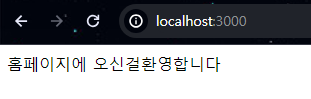

# 2024모각소 0124

## 전체 목표

1. Node.js의 개념을 정확히 이해하기
2. Node.js를 통해 외부 API 연동해 나만의 웹 서버 하나 만들어보기


## 0124 목표
1. 실제 node.js 예제 실행 및 코드 이해


``` js

const express = require('express')
// express라는 npm 모듈 요청
const app = express()
//express 함수를 app이라고 함
const port = 3000
// 포트 3000번 설정

app.set(`view engine`,`ejs`)
app.set(`views`,`./views`)
app.get('/', (req, res) => {
  res.send('<h1>Hello World!<h1>')
})

app.get('/test', (req, res) => {
    res.send('<h1>test<h1>!')
  })
//라우터 개념 /사용자에게 response로 응답 전달 `Hello World` 전송

app.listen(port, () => {
  console.log(`Example app listening on port ${port}`)
})
//먼저 console에 출력

```

*  헤더와 포트 프로필 홈 파일등 `별도로 분리`되어야 관리좋음
    * `EJS` 통해 분리

* `/ 후 tab`을 누르면 홈페이지에 필요한 index 자동으로 입력되어짐

``` js
// ./views 폴더에 index.js로 홈페이지에 보여질 화면 코드
<!DOCTYPE html>
<html lang="en">
<head>
    <meta charset="UTF-8">
    <meta name="viewport" content="width=device-width, initial-scale=1.0">
    <title>Document</title>
</head>
<body>
    홈페이지에 오신걸환영합니다
</body>
</html>
```
```js
//위 코드 활성화하기 위한 방법
app.set(`view engine`,`ejs`)
app.set(`views`,`./views`)
//화면상보여지는것

app.get('/', (req, res) => {
  res.render('index') //./views/index.ejs 출력
})

```
      

``` js
<!DOCTYPE html>
<html lang="en">
<head>
    <meta charset="UTF-8">
    <meta name="viewport" content="width=device-width, initial-scale=1.0">
    <title>Document</title>
</head>
<body>
    <h1> 홈페이지에 오신걸환영합니다</h1>
<header>
    <nav>
        홈
        프로필
        찾아오시는길
        문의하기
    </nav>
</header>
</body>
</html>
```

* `header`: 문서나 특정 섹션(section)의 헤더(header)를 정의할 때 사용
  * 헤더(header)는 보통 도입부에 해당하는 콘텐츠나 네비게이션 링크의 집합 등과 같은 정보를 포함

    - 하나 이상의 제목 요소(h1 ~ h6)

    - 로고(logo)나 아이콘(icon)

- 저자(author) 정보
* `nav`:   다른 페이지 또는 현재 페이지의 다른 부분과 연결되는 네비게이션 링크(navigation links)들의 집합을 정의할 때 사용
  * `<nav>` 요소를 사용하는 일반적인 예로는 메뉴, 목차, 인덱스 등 글을 읽지 못하는 사용자를 위한 스크린 리더기와 같은 브라우저는 `<nav>` 요소를 사용하여 해당 콘텐츠의 초기 렌더링을 생략할지 여부를 결정

* `a href`: 하이퍼링크로   하나의 페이지에서 다른 페이지를 연결할 때 사용하는 하이퍼링크(hyperlink)를 정의할 때 사용
* `footer`:문서나 특정 섹션(section)의 푸터(footer)를 정의할 때 사용
  * 푸터(footer)는 보통 `<footer>` 요소가 포함되어 있는 문서나 섹션에 대한 아래와 같은 정보를 포함

    - 저자(author) 정보

    - 저작권 정보

    - 연락처

    - 사이트맵(sitemap)

    - 페이지 맨 위로 되돌아갈 수 있는 Top 버튼

    - 연관 페이지 등
* 
* `hr`: 콘텐츠 내용에서 주제가 바뀔 때 사용할 수 있는 수평 가로선을 정의할 때 사용
  *  HTML 문서에서 내용을 구분하거나 주제의 변화를 정의

* 참고영상 [유니다고 웹사이트 만들기](https://www.youtube.com/watch?v=hfKmOazBEEQ&ab_channel=%EC%9C%A0%EB%8B%88%EB%8B%A4%EA%B3%A0)