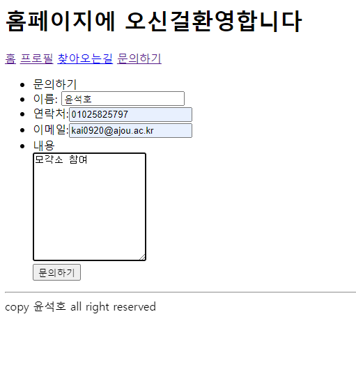

# 2024모각소 0124

## 전체 목표

1. Node.js의 개념을 정확히 이해하기
2. Node.js를 통해 외부 API 연동해 나만의 웹 서버 하나 만들어보기

## 0124 목표
1. 지난주에 이어 코드 이해
    * 작동만 되는 것이 아니라 왜 코드의 구체적 이해 및 왜 그런지 이해하기
    * 코드의 최적화

### front 의 관리

* header, footer, index 분리
    + 하나의 파일에 header, footer, index를 모아놓아도 됨
    * 하지만 가독성 및 관리를 위해서 따로 분리해야 좋음

    ``` html
            <!DOCTYPE html>
    <html lang="en">
    <head>
        <meta charset="UTF-8">
        <meta name="viewport" content="width=device-width, initial-scale=1.0">
        <title>Document</title>
    </head>
    <body>
        <h1> 홈페이지에 오신걸환영합니다</h1>
    <header>
        <nav>
            <a href="/">홈</a>
            <a href="/profile">프로필</a>
            <a href="/map">찾아오는길</a>
            <a href="/contact">문의하기</a>

        </nav>
    </header>


    윤석호
    
    <footer>
        <hr>
        copy 윤석호 all right reserved
    </footer>
    </body>
    </html>
    
    ```

*  이렇게 하나의 파일에 모든걸 작성해도 되지만

    ``` html
    <!-- footer.ejs-->
    <footer>
    <hr>
    copy 윤석호 all right reserved
    </footer>
    </body>
    </html>

    ``` 
    ``` html
    <!--header.ejs-->
    
        <!DOCTYPE html>
    <html lang="en">
    <head>
        <meta charset="UTF-8">
        <meta name="viewport" content="width=device-width, initial-scale=1.0">
        <title>Document</title>
    </head>
    <body>
        <h1> 홈페이지에 오신걸환영합니다</h1>
    <header>
        <nav>
            <a href="/">홈</a>
            <a href="/profile">프로필</a>
            <a href="/map">찾아오는길</a>
            <a href="/contact">문의하기</a>

        </nav>
    </header>

    ```
    ``` html

    <!-- inex.ejs -->

    <%-include('header.ejs')%>

        윤석호
        
    <%-include('footer.ejs')%>

    ```
  * 이렇게 파일의 내용마다 분리하여 작성한 다음 하나의 파일에 **<%-include('header.ejs')%>** 이렇게 `<%-include(파일)%>`을 통해 분리한 파일들을 넣어 똑같은 역할을 할 수 있음
  * 이렇게 함으로써 훨씬 더 코드 파악 및 관리에 유리함

  ```  html
  <!-- profile.ejs> -->
  <%-include(`header.ejs`)%>

<ul>
    <li>이름:윤석호</li>
    <li>이메일:kai0920@ajou.ac.kr</li>
    <li>주소:아주대학교</li>
</ul>

<%-include(`footer.ejs`)%>

  ```
* 이렇게 profile.ejs 설정한다음

``` js
app.get('/', (req, res) => {
  res.render('index') //./views/index.ejs 출력
})
app.get('/profile', (req, res) => {
  res.render('profile')
})
```
* 이 코드 `get`을 통해 라우터를 지정해주면 `해당 index`, `해당 profile`에 접근 가능하며 간단하게 필요한 정보들을 보여줄 수 있음


``` html
<%-include(`header.ejs`)%>

<ul>
    <li>문의하기</li>
    <li>이름: <input type="text" name="name" required></li>
    <li>연락처:<input type="text" name="phone" required></li>
    <li>이메일:<input type="text" name="email" required></li>
    <li>내용<br>
    <textarea name="memo" clos="50"rows="10"></textarea> </li>
</ul>

<%-include(`footer.ejs`)%>

```
* `textarea`:사용자가 여러 줄의 텍스트를 입력할 수 있는 텍스트 입력 영역을 정의할 때 사용
    * 텍스트 입력 영역에는 개수의 제한 없이 문자를 입력할 수 있으며, 입력된 문자는 고정폭 글꼴로 렌더링
    * 텍스트 입력 영역의 크기는 `<textarea>` 요소의 cols 속성과 rows 속성으로 지정할 수 있으며, CSS에서 height 속성과 width 속성을 사용하면 더욱 손쉽게 지정 
* `br`: 텍스트 내의 줄바꿈(line-break)을 정의할 때 사용
    * HTML 소스 코드 내에서는 엔터(Enter)를 사용하여 줄바꿈을 실시하여도 브라우저 화면에 실제로 적용되지는 않음
    * 따라서 <br> 요소는 주소(address)나 시(poem) 등 줄바꿈이 중요한 텍스트에 유용하게 사용
    * **<br> 요소는 빈 태그(empty)로, 종료 태그가 존재하지 않음**
    * 예제 코드
     ``` html 
     <p>
    HTML은 HyperText Markup Language의 약자입니다.
    웹 페이지는 HTML 문서라고도 불리며,
    HTML 태그들로 구성됩니다.
    </p>
    <p>
    HTML은 HyperText Markup Language의 약자입니다.<br>
    웹 페이지는 HTML 문서라고도 불리며,<br>
    HTML 태그들로 구성됩니다.
    </p>
    <!-- 종료코드가 없음--> 
     ```


+ `form action`:사용자로부터 입력을 받을 수 있는 HTLM 입력 폼(form)을 정의할 때 사용
    * <form> 요소는 다음과 같은 요소들을 하나 이상 포함할 수 있음
    ```
    - <button>

    - <fieldset>

    - <input>

    - <label>

    - <option>

    - <optgroup>

    - <select>

    - <textarea>
    ```
    * `action`: 해당 코드 실행시 라우터 지정
    * `textarea`:사용자가 여러 줄의 텍스트를 입력할 수 있는 텍스트 입력 영역을 정의할 때 사용
        * 텍스트 입력 영역에는 개수의 제한 없이 문자를 입력할 수 있으며, 입력된 문자는 고정폭 글꼴로 렌더링
        * 텍스트 입력 영역의 크기는 `<textarea>` 요소의 cols 속성과 rows 속성으로 지정할 수 있으며, CSS에서 height 속성과 width 속성을 사용하면 더욱 손쉽게 지정

* `app.get('/contactProc', (req, res) =>`
    * `req`: 사용자 요청 받기
    * `res`: 프로그램이 어떻게 응답할지

``` html

<%-include(`header.ejs`)%>
<form action="/contactProc" method="post">
<ul>
    <li>문의하기</li>
    <li>이름: <input type="text" name="name" required></li>
    <li>연락처:<input type="text" name="phone" required></li>
    <li>이메일:<input type="text" name="email" required></li>
    <li>내용<br>
    <textarea name="memo" clos="50"rows="10"></textarea> </li>
    <button>문의하기</button>
</ul>
</form>
<%-include(`footer.ejs`)%>

```

``` js
app.post('/contactProc', (req, res) => {
  const name=req.body.name;
  const phone=req.body.phone;
  const email=req.body.email;
  const memo= req.body.memo;
  var a= `안녕하세요 ${name} ${phone} ${email} ${memo}`
  res.send(a);
})

```
#### html 코드 실행시
<form action="/contactProc" method="post">
<ul>
    <li>문의하기</li>
    <li>이름: <input type="text" name="name" required></li>
    <li>연락처:<input type="text" name="phone" required></li>
    <li>이메일:<input type="text" name="email" required></li>
    <li>내용<br>
    <textarea name="memo" clos="50"rows="10"></textarea> </li>
    <button>문의하기</button>
</ul>
</form>

* 위 html 코드를 통해 사용자들이 정보 입력후 `<buttom>`을 통해 사용자가 요청을 보내면 서버는 요청받은 정보를 저장할 수 있음
* `body parser`: body-parser는 미들웨어로 요청(request)과 응답(response) 사이에서 공통적인 기능을 수행하는 소프트웨어
    *  요청의 본문을 지정한 형태로 파싱해주는 미들웨어
    *  request의 body부분을 자신이 원하는 형태로 파싱
    * HTTP 요청 body 파싱
    * `npm install body-parser` 와 `var bodyParser= require(body-parser) app.use(bodyParser.urlencoded({ extended: false }))`를 통해 사용가능


> 요청보내기   
      

> 결과   
      


*