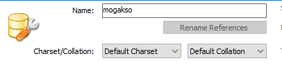
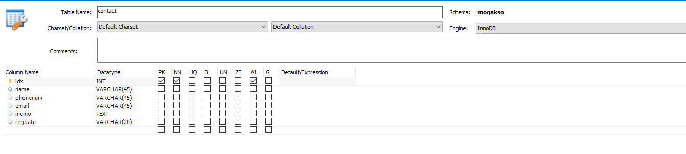
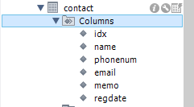
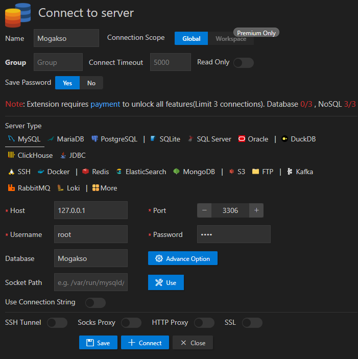
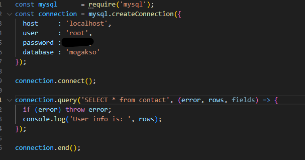
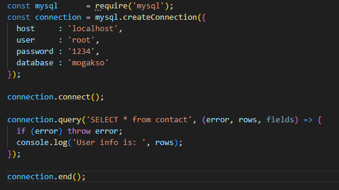
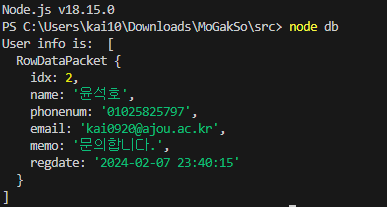
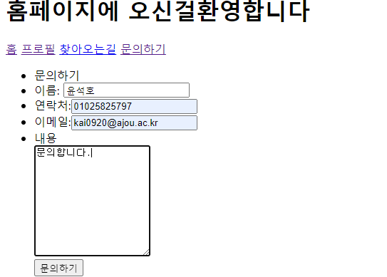
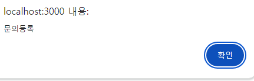

# 2024모각소 0208

## 전체 목표

1. Node.js의 개념을 정확히 이해하기
2. Node.js를 통해 외부 API 연동해 나만의 웹 서버 하나 만들어보기

## 0208 목표
1. 백엔드와 db 연동


## mysql 연동
* mysql 통해 `mogakso` skema 생성 

      

* `contact` table과 `id` `name` `phonenum` `email` `memo` `regdate` column 생성

      

      

*  vsc database 확장 이용해 db 연동

      

*  `db.js`에 연동하고자 하는 db 정보 입력

      

*  db 연동 확인

      

      

* `node.js`에서의 적용

    * **1.** db 정보 입력
    ``` js
    module.exports= {
    host     : 'localhost',
    user     : 'root',
    password : '1234',
    database : 'mogakso'
    };
    ```
    * **2.** index.js 수정
    ``` js
    const mysql      = require('mysql');
    const dbconfig   = require('./db.js');
    const connection = mysql.createConnection(dbconfig)
    ```
    * 추가하여 mysql 연동


    * **3.** 사용자의 입력 받기
    
    ``` js

    app.post('/contactProc', (req, res) => {
    const name=req.body.name;
    const phone=req.body.phone;
    const email=req.body.email;
    const memo= req.body.memo;

    var sql= `insert into contact(name,phonenum,email,memo,regdate)
    values('${name}','${phone}','${email}','${memo}',now() )`
    connection.query(sql,function(err,result){
        if (err) throw err;
        console.log(`삽입성공`)
        res.send(" <script> alert('문의등록'); location.href=`/`</script>")
        })

        })
    ```
        
    ```  js
    const name=req.body.name;
    const phone=req.body.phone;
    const email=req.body.email;
    const memo= req.body.memo;
    ```
    * 입력받은 정보 변수로 저장

    ``` js

    var sql= `insert into contact(name,phonenum,email,memo,regdate)
    values('${name}','${phone}','${email}','${memo}',now() )`
    ```
    * `contact` table에 저장하기 위한 `sql문` 실행


    ``` js
    res.send(" <script> alert('문의등록'); location.href=`/`</script>")

    ```
    * `문의등록`이라는 성공메시지 출력 및 이후 `홈페이지`로 돌아오도록 `location.href='/' `


* 연동 결과

* 사용자의 정보 입력

      
      

* db에 잘 적용되었나 확인


      
