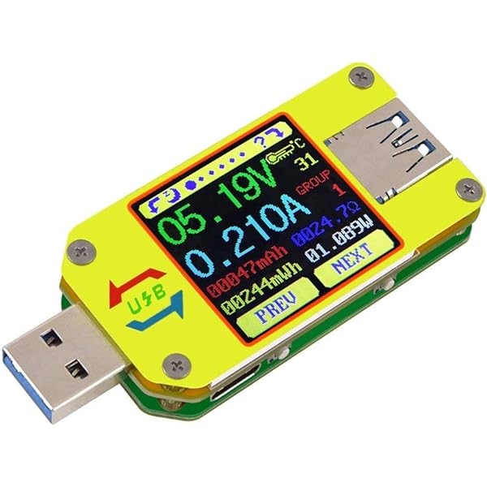
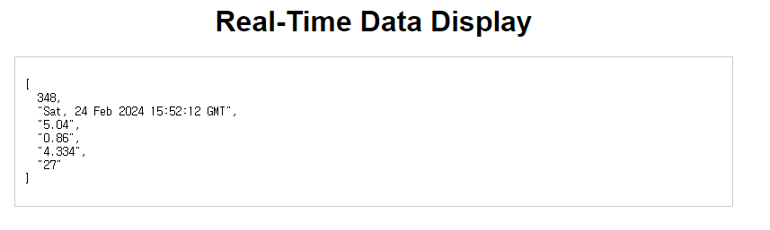

# 2024모각소 0214

## 전체 목표

1. Node.js의 개념을 정확히 이해하기
2. Node.js를 통해 외부 API 연동해 나만의 웹 서버 하나 만들어보기

## 0214 목표
1. API 만들어보기
2. API 적용한 실시간 정보 제공 웹페이지 만들어보기


## UM34C라는 bluetooth 실시간 data meter의 데이터 추출api 만들어보기



* 전류 및 전압, 전력 등을 측정할 수 있는 디지털 멀티미터

## bluetooth 기기 UM34C의 데이터 추출 코드
``` python
# https://github.com/sebastianha/um34c

from interfaces.um import UmRfcommInterface

address = "98:DA:F0:00:34:6F"
# 연결하고자 하는 bluetooth기기의 주소
interface = UmRfcommInterface(address)
# 블루투스 기기와의 연결 위한 주소 등록
interface.connect()
# 블루투스 기기 연결
value = interface.read()
# 실행될 때마다 UM34C의 데이터 추출
```

## 데이터 db에 저장하는 코드

``` python

def db_insert_worker(q, cur, conn, lock):
    while True:
        value = q.get()
        if value is None:
            break
        lock.acquire()
        try:
            sql = "insert into data(time,voltage,cur,power,temperature) values(%s, %s, %s, %s, %s)"
            val = (
                "2024-02-29 15:51:08",
                "5.04",
                "0.86",
                "4.334",
                "27",
            )
            cur.execute(sql, val)
            conn.commit()
        finally:
            lock.release()
        q.task_done()

        
address = "98:DA:F0:00:34:6F"
interface = UmRfcommInterface(address)
interface.connect()

csvfile = open("savepower.csv", "w", newline="")
csv_writer = csv.writer(csvfile)
csv_writer.writerow(["Time", "Voltage", "Current", "Power", "Temperature"])

lock = threading.Lock()
q = queue.Queue()

db_thread = threading.Thread(target=db_insert_worker, args=(q, cur, conn, lock))
db_thread.start()

while True:
    value = interface.read()
    # value = count
    time.sleep(1)
    q.put(value)
    count += 1
    print(count)
# Wait until all tasks are done
q.join()

# Terminate the thread
q.put(None)
db_thread.join()


```

## 연동된 db의 정보 실시간으로 1초마다 보여주는 server.py

### flask를 통한 웹서버
``` py
from flask import Flask, render_template, jsonify
import mysql.connector

app = Flask(__name__)

# MySQL 연결 설정
db_config = {
    "host": "127.0.0.1",
    "user": "root",
    "password": "1234",
    "database": "data2",
}


def get_latest_data():
    try:
        # MySQL 데이터베이스 연결
        connection = mysql.connector.connect(**db_config)

        # 쿼리 실행
        cursor = connection.cursor()
        cursor.execute("SELECT * FROM data ORDER BY id DESC LIMIT 1")
        latest_data = cursor.fetchone()

        # 연결 종료
        cursor.close()
        connection.close()

        return latest_data
    except Exception as e:
        print("Error fetching latest data:", e)
        return None


@app.route("/")
def index():
    return render_template("index.html")


@app.route("/latest_data")
def latest_data():
    data = get_latest_data()
    return jsonify({"data": data})


if __name__ == "__main__":
    app.run(debug=True)

```


### node.js를 통한 웹서버

``` js
const express = require('express');
const mysql = require('mysql');

const app = express();

// MySQL 연결 설정
const db_config = {
    host: "127.0.0.1",
    user: "root",
    password: "1234",
    database: "data2"
};

// MySQL 연결 생성
const connection = mysql.createConnection(db_config);

// MySQL 연결 확인 및 재연결 함수
function handleDisconnect() {
    connection.connect(function(err) {
        if(err) {
            console.error('Error connecting to database:', err);
            setTimeout(handleDisconnect, 2000); // 연결 재시도
        }
    });

    connection.on('error', function(err) {
        console.error('Database error:', err);
        if(err.code === 'PROTOCOL_CONNECTION_LOST') { // 연결이 끊어진 경우
            handleDisconnect();
        } else {
            throw err;
        }
    });
}

handleDisconnect(); // 초기 연결 설정

// 최신 데이터 가져오기
function getLatestData(callback) {
    connection.query("SELECT * FROM data ORDER BY id DESC LIMIT 1", function(err, rows) {
        if(err) {
            console.error('Error fetching latest data:', err);
            callback(err, null);
        } else {
            callback(null, rows[0]);
        }
    });
}

// 루트 경로
app.get('/', function(req, res) {
    res.sendFile(__dirname + '/index.html');
});

// 최신 데이터 API 엔드포인트
app.get('/latest_data', function(req, res) {
    getLatestData(function(err, data) {
        if(err) {
            res.status(500).json({ error: 'Error fetching latest data' });
        } else {
            res.json({ data });
        }
    });
});

// 서버 시작
const PORT = process.env.PORT || 3000;
app.listen(PORT, function() {
    console.log(`Server is running on port ${PORT}`);
});

```
### html
``` html
<!DOCTYPE html>
<html lang="en">
<head>
    <meta charset="UTF-8">
    <meta name="viewport" content="width=device-width, initial-scale=1.0">
    <title>Real-Time Data Display</title>
    <style>
        body {
            font-family: Arial, sans-serif;
            margin: 0;
            padding: 0;
        }
        .container {
            max-width: 800px;
            margin: 0 auto;
            padding: 20px;
        }
        h1 {
            text-align: center;
            margin-bottom: 20px;
        }
        #latestData {
            border: 1px solid #ccc;
            padding: 10px;
            margin-bottom: 20px;
        }
        pre {
            white-space: pre-wrap;
        }
        .header {
            position: relative;
        }
        .header h2 {
            position: absolute;
            top: 20px;
            right: 20px;
            font-size: 24px;
            color: #333;
        }
    </style>
</head>
<body>
    <div class="header">
        <h2>아주대 모각소</h2>
    </div>
    <div class="container">
        <h1>Real-Time Data Display</h1>
        <div id="latestData">
            <!-- 최신 데이터가 여기에 표시될 것입니다. -->
        </div>
    </div>

    <script src="https://ajax.googleapis.com/ajax/libs/jquery/3.5.1/jquery.min.js"></script>
    <script>
        // 최신 데이터를 가져오는 함수
        function getLatestData() {
            $.ajax({
                url: '/latest_data',
                type: 'GET',
                success: function(response) {
                    // 성공적으로 데이터를 가져온 경우 최신 데이터를 업데이트
                    var latestData = response.data;
                    // 최신 데이터를 화면에 표시
                    $('#latestData').html(
                        '<p>TIME: ' + latestData.time + '</p>'+
                        '<p>TEMP: ' + latestData.temp + '</p>' +
                        '<p>POWER: ' + latestData.power + '</p>' +
                        '<p>VOLTAGE: ' + latestData.voltage + '</p>'+
                        '<p>CURRENT: ' + latestData.current + '</p>'

                    );
                },
                error: function(error) {
                    // 오류가 발생한 경우 오류 메시지를 출력
                    console.error('Error fetching latest data:', error);
                }
            });
        }

        // 페이지가 로드될 때 최신 데이터 가져오기
        $(document).ready(function() {
            getLatestData();
            // 1초마다 최신 데이터 업데이트
            setInterval(getLatestData, 1000);
        });
    </script>
</body>
</html>

```

## 결과




* UM34C의 입력된 값들 모두 db에 저장가능
* 실시간으로 bluetooth 기기의 정보 웹사이트로 확인가능